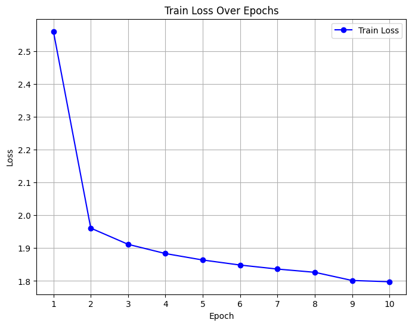
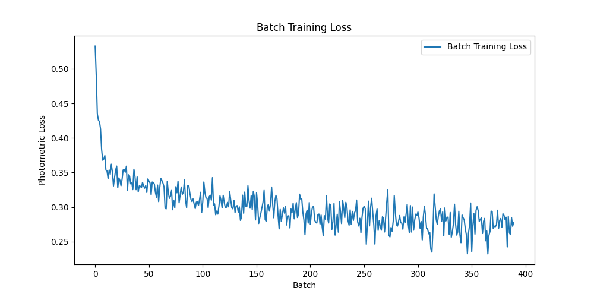
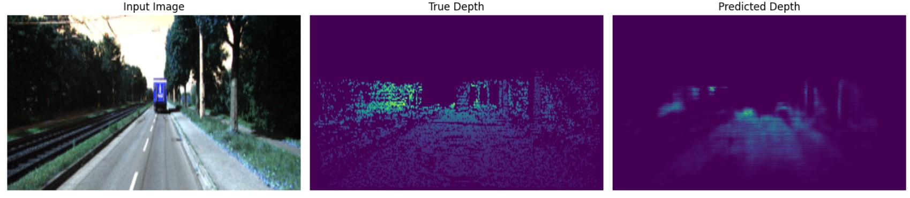

# Monocular Depth Estimation

## Overview
This project focuses on estimating depth from a single image using a deep learning approach. The objective is to develop and evaluate a monocular depth estimation model leveraging both supervised and self-supervised learning techniques. 

---

## Project Structure

- **`depth_model_demonstration_video/`**: Contains demo videos showcasing the results of depth estimation.
- **`figures/`**: Visuals used in the project, including model architecture diagrams, training loss graphs, and example outputs.
- **`models/`**: Trained model checkpoints and configurations.
- **`self-supervised_training_history/`**: Training logs and plots for the self-supervised approach.
- **`supervised_training_history/`**: Training logs and plots for the supervised approach.
- **`Monocular Depth Estimation Notebook.ipynb`**: Jupyter notebook for training and evaluating the model.
- **`CS482682 Final Project Report Group 12 Report.pdf`**: Detailed project report.
- **`CS482682 Final Project Report Group 12 Pitch.pdf`**: Project pitch presentation.

---

## Model Architecture
The monocular depth estimation model comprises:
1. **Encoder**: Convolutional backbone extracts spatial features.
2. **Decoder**: Transforms encoded features into depth predictions using upsampling layers.
---

## Training Process
### Supervised Learning
- **Loss Function**: Scale-invariant depth loss.
- **Results**:
  
  

### Self-Supervised Learning
- **Loss Function**: Photometric reconstruction loss.
- **Results**:
  
  

---

## Results

### Qualitative Results
Predicted depth maps show promising visual quality:

---

## Demonstration
Demo videos illustrating model predictions:
- [Demo Video 1](depth_model_demonstration_video/depth_model_example_video.avi)

## References
[1] D. Eigen, C. Puhrsch, and R. Fergus, “Depth map prediction from a single image using a multi-scale deep network,” 2014. [Online]. Available: https://arxiv.org/abs/1406.2283

[2] F. Liu, C. Shen, G. Lin, and I. Reid, “Learning depth from single monocular images using deep convolutional neural fields,” IEEE Transactions on Pattern Analysis and Machine Intelligence, vol. 38, no. 10, 2016. [Online]. Available: http://dx.doi.org/10.1109/TPAMI.2015.2505283

[3] T. Zhou, M. Brown, N. Snavely, and D. G. Lowe, “Unsupervised learning of depth and ego-motion from video,” 2017. [Online]. Available: https://arxiv.org/abs/1704.07813

[4] C. Godard, O. M. Aodha, M. Firman, and G. Brostow, “Digging into self-supervised monocular depth estimation,” 2019. [Online]. Available: https://arxiv.org/abs/1806.01260

---

## Acknowledgments
We extend our gratitude to our project mentors Xuzhe Zhi, Jan Emily Mangulabnan, and the CS482/682 Machine Learning: Deep Learning course team for their guidance and support during this project.
